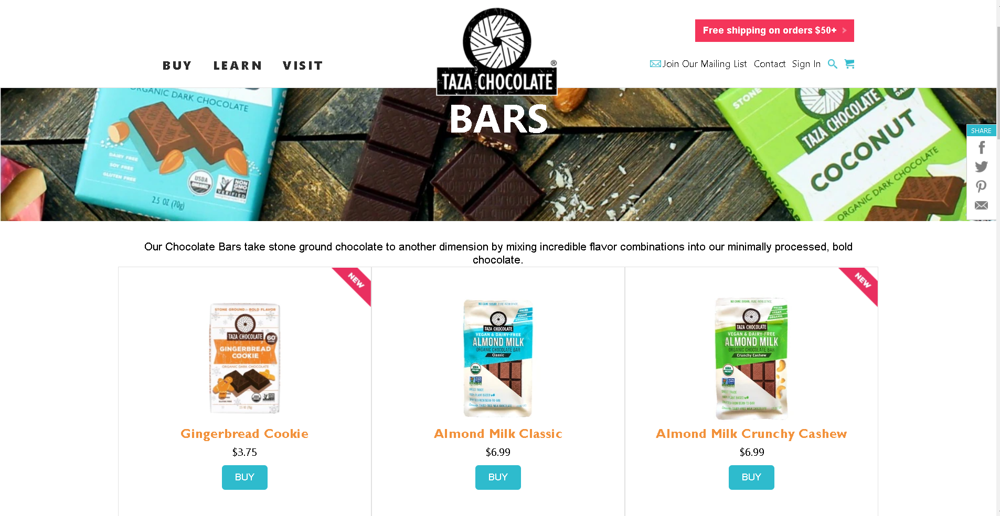

# Shopping-Cart
# Team Triangle

# Taza- Clone
  

Taza Chocolate is a Mexican-inspired stoneground, organic chocolate manufacturer based in Somerville, MA, USA.
Taza is probably the least-processed chocolate you can find. THE USDA organic chocolate combines just cocoa beans and sugar.
 

## Tech Stack used:

<code></code>
<code></code>
<code></code>
<code></code>
<code></code>
<code></code>
<code></code>
<code></code>
<code></code>

## Sneak peek

## <code>Landing Page</code>

## <code>Home Page</code>

### Installation and Setup Instructions

Clone down this repository. You will need node and npm installed globally on your machine. Installation: npm install To Run Test Suite: npm test To Start Server: npm start To Visit App: localhost:3000/

## Tech Library used:
  <ul>
  <li>React APP</li>
  <li>Axios</li>
  <li>Material UI</li>
<li>bcryptjs</li>
<li>concurrently</li>
<li>cors</li>
<li>dotenv</li>
<li>express</li>
<li>joi</li>
<li>jsonwebtoken</li>
<li>mongoose</li>
<li>razorpay</li>
<li>react-router-dom</li>
<li>request</li>
<li>uuid</li>
    <li>email-validator</li>
    <li>react</li>
    <li>react-dom</li>
    <li>react-icons</li>
    <li>react-modal</li>
    <li>react-redux</li>
    <li>react-router-dom</li>
    <li>redux</li>
    <li>redux-thunk</li>
    <li>styled-components</li>
  </ul>

### Acknowledgments

  We take all the responsiblity for every single line of code. The design inspired from Taza Chocolate

